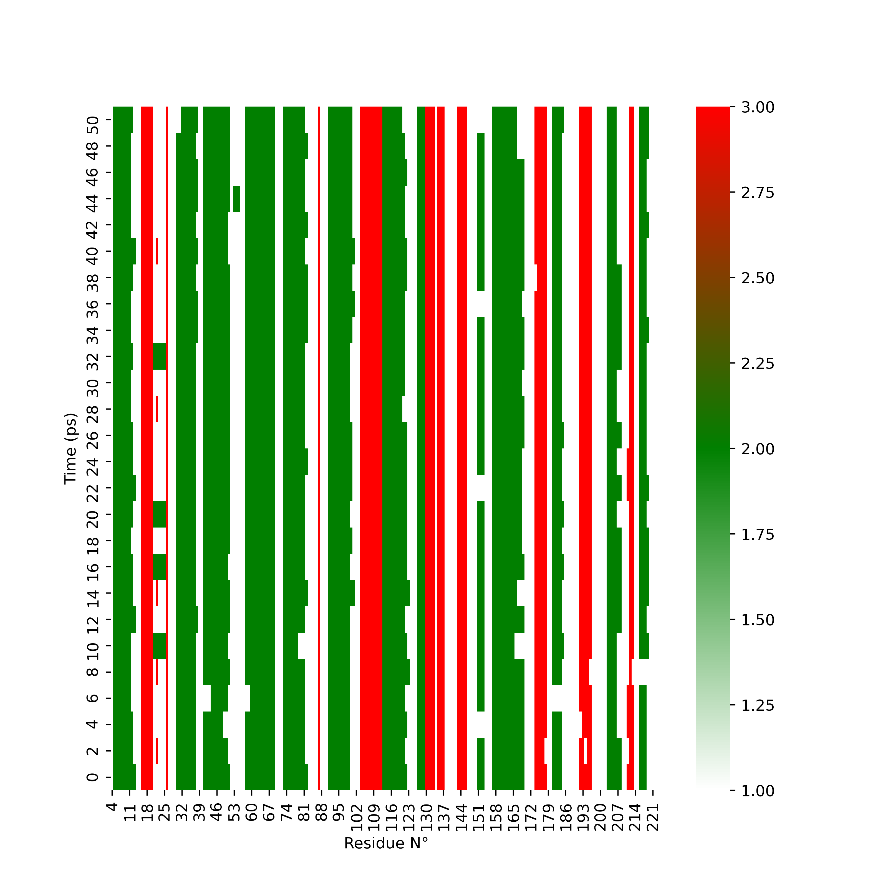

# Secondary Structure heatmap generator

Author: Eddy BARRAUD

Contact: <eddy.barraud@outlook.fr>

Public access: [https://github.com/Eddy-Barraud/2ndStructure](https://github.com/Eddy-Barraud/2ndStructure)

Requirements : pandas matplotlib seaborn mdtraj

This script is calculating the secondary structure of each protein residue across simulation time with a library included DSSP tool.

Generated heatmap values have these meanings :
-   1: Coil or Undefined
-   2: Helix
-   3: Strand

The python script behind the app is using [Seaborn](https://github.com/mwaskom/seaborn) and [MDTraj](https://github.com/mdtraj/mdtraj) libraries.

1. Create files only for protein/residue of interest with GROMACS

Example : 

`gmx editconf -f npt_5.gro -n index.ndx -o try.gro`

`gmx trjconv -f npt_5.xtc -s npt_5.tpr -n index.ndx -o try.xtc`

2. Copy, under the same filename, the trajectory and the topology to the directory where the DssAny.py file is located at. See example files in the Example folder.

3. Run the script.

It will create a file, named filename.dssp.png.